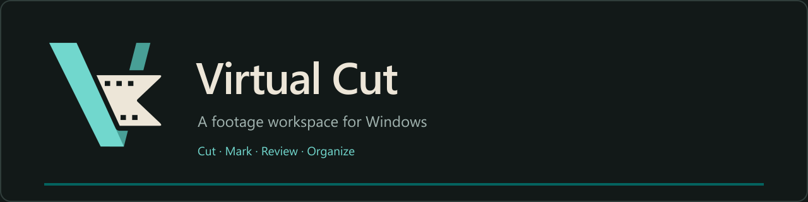

<p align="center">
  
</p>

**Virtual Cut** is a Windows desktop workspace for working through recorded footage: find moments, make clips, keep contextual markers, and review where everything belongs. Built with Electron, React, TypeScript, and CSS Modules, with an explicit DaVinci Resolve marker-metadata helper.

## Status

**Current version: 0.4.15**, in review on branch `m3-audio-intelligence`. M1 (project workspace) and M2 (first production batch, accepted in 0.3.23) are complete. M3 audio intelligence adds explicit local transcription with separate game and microphone results, a floating word-seeking transcript window, original-preserving corrections, reviewed spoken cues (Marker preferred), project/batch game context and optional managed speech setup. Agent assistance (M4) and Connections/glossary (M5) are planned. Version 0.4.8 keeps long projects saving and reopening, replaces once-per-second polling with change notifications and upgrades projects to saved format 5. Version 0.4.9 makes the local speech setup show which setup is in use and where, 0.4.10 notices setup files moved or deleted outside the app, and 0.4.11 simplifies it to one speech engine. Version 0.4.12 adds a 6× speed step with preview audio and keeps the transcript on the right page after a quick pause or seek. Version 0.4.13 makes each recording's filmstrip once, in the background after import, and keeps it in the project cache so zooming and panning show thumbnails at once. Version 0.4.14 removes the brief "Loading filmstrip…" flash, marks recordings whose filmstrip is still being made, and shows the version in the bottom bar. Version 0.4.15 puts the transcript window controls in one toolbar row with filter chips and an Export menu, replaces the F11 hint with a Help button listing the spoken cues, and doubles the pictures shown while scanning in reverse. See the [current review](docs/review-0.4.15.md), the [changelog](CHANGELOG.md) and [M3 engineering notes](docs/m3-implementation.md).

| Page        | Current preview                                                                                                                                                                             |
| ----------- | ------------------------------------------------------------------------------------------------------------------------------------------------------------------------------------------- |
| **Media**   | Browse recordings in a thumbnail grid or list beside the viewer.                                                                                                                            |
| **Cut**     | J/K/L playback, frame and keyframe steps, scrubbing, editable clips and markers, and frame capture. Overlapping clips have separate rows, consistent colors, and clear selected boundaries. |
| **Review**  | Folder-grouped clip cards, inline previews, pending-change indicators, and an Accept / Hold / Queue / Done workflow.                                                                        |
| **Library** | Search completed clips and annotations, preview independently of originals, and relink moved outputs. The sample workspace retains its glossary and connections prototype.                  |
| **Selects** | A prototype for assembling selects and string-outs; further development is deferred.                                                                                                        |
| **Handoff** | Resolve marker-helper status, installation and handoff guidance.                                                                                                                            |

A separate floating **Transcription** window opens from Cut for word seeking, search, corrections and spoken-cue review.

## Run the app

With Node 22.12+ installed:

```powershell
npm ci
npm run dev
```

Development needs FFmpeg and FFprobe on PATH (or `VIRTUAL_CUT_FFMPEG` / `VIRTUAL_CUT_FFPROBE` pointing to the executables). For a standalone desktop folder, run `npm run package:win`, then open `Virtual Cut.exe` inside the generated `release/Virtual-Cut-...` directory. The local Windows package includes the media tools. Keep the folder's files together; set `VIRTUAL_CUT_PACKAGE_DIR` to choose a different output location.

The app launches maximized; see the [user guide](docs/user-guide.md) for projects, Cut controls, playback and saving.

## Documentation

- [User guide: projects, Cut controls, playback and saving](docs/user-guide.md)
- [Changelog](CHANGELOG.md)
- [Decision records](docs/decisions/README.md) and [design decisions](docs/design-decisions.md)
- [Foundation guide: architecture, commands, verification, and current limits](docs/foundation.md)
- [Regression gates: fast, native, desktop and packaged tests](docs/testing.md)
- [Review planning, automatic destination holds and Manipulate mode](docs/review-planning.md)
- [Milestone 1: storage, timing, verification, and test recipe](docs/milestone-1.md)
- [Desktop workflow preview: interactions and limitations](docs/workflow-preview.md)
- [Layout concepts and review questions](docs/layout-concepts.md)

## Branding

The Film Edge mark combines overlapping teal blades with ivory film, using three perforations above and two below. The same SVG drives the app header, desktop icons, and repository artwork.

[SVG logo](design/brand/virtual-cut-logo.svg) · [Transparent PNG](design/brand/virtual-cut-logo.png) · [App icon](design/brand/virtual-cut-app-icon.png) · [Brand assets and palette](design/brand/README.md)

## Planning

- [Product flow, feature set, and staged build plan in Notion](https://app.notion.com/p/3ea7c5227a808000819af5c03bcfae3c)
- [Design decisions](docs/design-decisions.md)
- [Local transcription research](docs/research/local-transcription.md)
- [Spoken microphone cues: Mark, Cut, Note](docs/feature-requests/spoken-cues.md)
- [Deferred proxy feature request — GitHub issue #1](https://github.com/connsteele/Virtual-Cut/issues/1) ([local request](docs/feature-requests/proxies.md))

Planning documents describe the agreed direction and open validation work. The implemented scope is recorded separately in the foundation guide.
